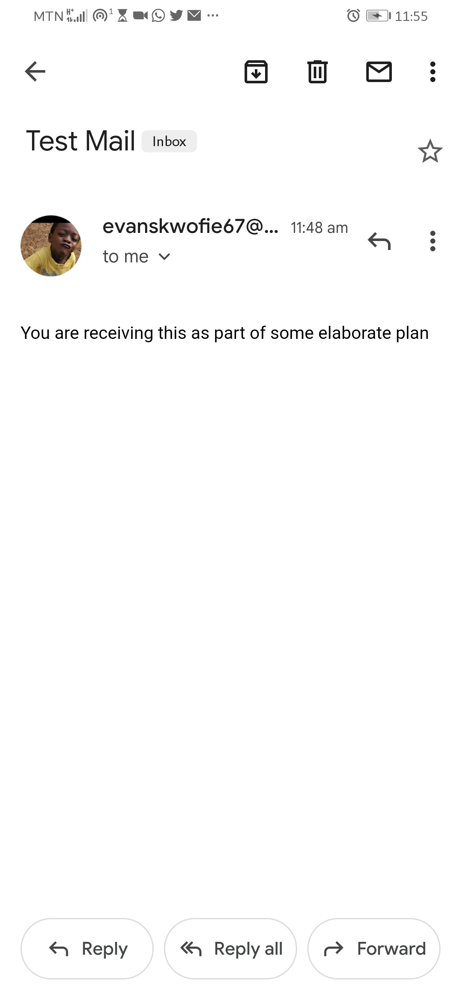

# email-sender

# to run the app
`npm run server` will serve the app on localhost:5000

# about the app
The app uses the nodemailer package to send an email address to my personal email address as it is provided in the env file. To test the app, please change the value for the `user` key in the env file to reflect your email addres. The app uses Gmail therefore you have to set up your application on Google Developer Console in order to obtain a password for the `pass` key in the env file. 

# what you will see 
After successfully setting up the project with the right information, you should see an email in the email address you provided to the `TO` key in the env file. Below is a copy of the email I received when I ran the app.

